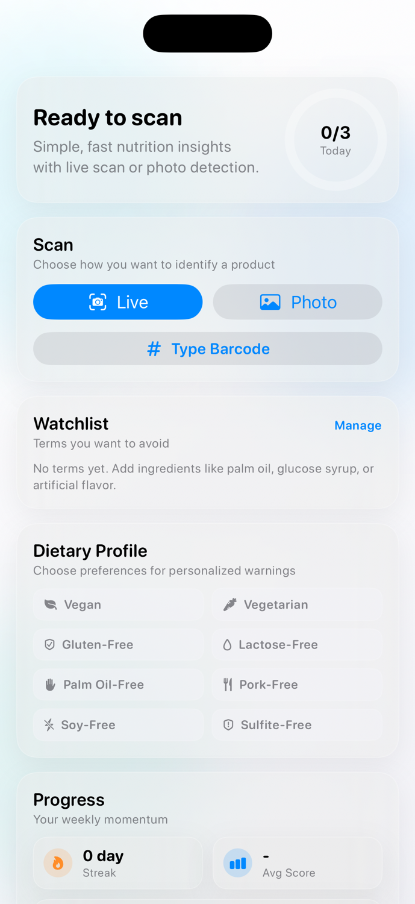
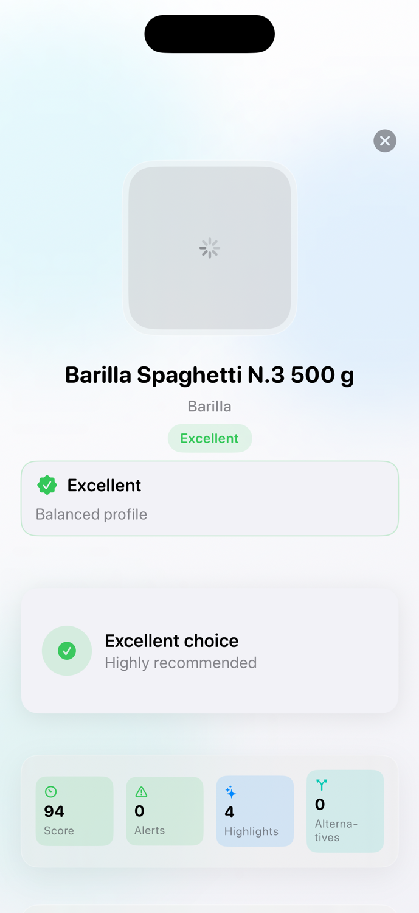
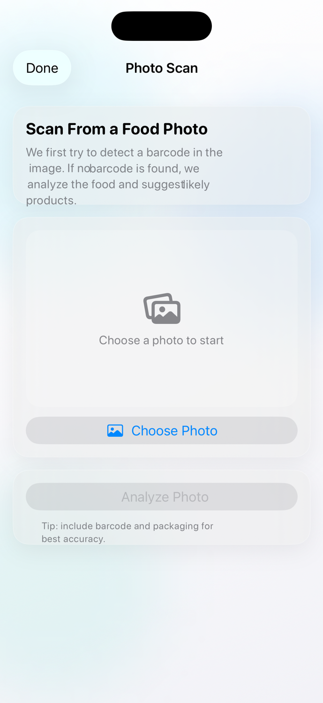

# CloneFood

Apple-style iOS app for scanning food products, reading nutrition quality, and getting healthier alternatives.

CloneFood combines live barcode scanning, photo-based scan fallback, Open Food Facts data, and a modern glass UI with smooth motion.

## Highlights

- Live barcode scanner with animated reticle
- Photo scan flow (detect barcode from image, then classify/suggest)
- Product health scoring (Nutri-Score, Eco-Score, NOVA, weighted overall score)
- Ingredient-focused insights and alert cards
- Dietary profile system (vegan, gluten-free, lactose-free, etc.)
- Personalized warnings for profile conflicts
- Better alternatives filtered by active dietary profile
- Favorites, history, streaks, and weekly activity
- Fast search with caching, filters, and relevance sorting

## Screenshots

| Home | Search |
|---|---|
|  |  |

| Product Detail | Photo Scan |
|---|---|
|  |  |

Product Detail screenshot sample product: **Barilla Spaghetti N.3 500 g** (barcode `8076800195033`).

| History | Favorites |
|---|---|
|  |  |

## Tech Stack

- SwiftUI
- AVFoundation
- Vision / VisionKit (photo scan pipeline)
- Open Food Facts API
- Xcode / iOS

## Requirements

- macOS with Xcode
- iOS 17+ recommended
- Physical iPhone recommended for barcode camera tests

## Run Locally

1. Open `CloneFood.xcodeproj` in Xcode.
2. Select the `CloneFood` scheme.
3. Run on simulator or device.

Optional command-line build:

```bash
xcodebuild -scheme CloneFood -project CloneFood.xcodeproj \
-destination 'platform=iOS Simulator,name=iPhone 17,OS=latest' build
```

## Permissions

- Camera: required for live barcode scanning
- Photo Library: required for photo scan input

## Data Source

- Open Food Facts: https://world.openfoodfacts.org

## Project Structure

```text
CloneFood/
  Models/
  Services/
  ViewModels/
  Views/
```

## Notes

- Product quality depends on available Open Food Facts data.
- Some products may have incomplete nutriments/ingredients metadata.
